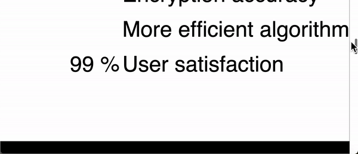

# graphic-website
Graphic website of Encryption code, with a lot of interactive things

It is supposed to end up similar to the apple website
- Animations while scrolling
- Fading in and out by scrolling

## Check out what's done 

- Scroll through effects sequence
  - Data security redefined and Encryption code 2.2 float in and fade in
  - 4 lines come in from 2 sides and all new features fades in
  - Black page opens upwards revealing 99% encryption accuracy
  - Encryption accuracy stops moving down and stays with other words
  - 99% moves down to more efficient algorithms
  - Security is built in
  - Security features fade in

- problems
  - the 99% thing staying in the center while scrolling moves up and down a bit too much

- I also want to make it so that there is an image animating but that would be hard
  - I would have to have multiple frames from different angles and display them one by one
